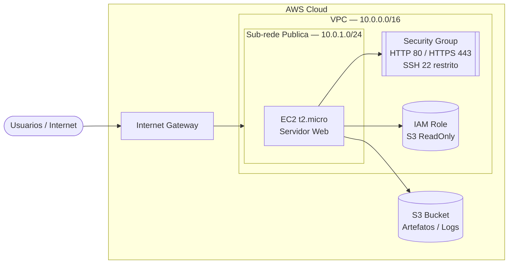

# AWS Secure WebApp on EC2 inside VPC


> Provisionamento de aplicacao web segura na AWS com EC2 em VPC dedicada, controle de acesso via IAM, Security Groups restritivos e infraestrutura como codigo com Terraform.

---

## Problema

Empresas precisam publicar aplicacoes na nuvem sem expor recursos de forma insegura. Projetos iniciantes frequentemente ignoram segmentacao de rede, controle de acesso e o principio do menor privilegio, criando ambientes vulneraveis e dificeis de auditar.

---

## Objetivo

Demonstrar como provisionar uma aplicacao web simples na AWS dentro de uma arquitetura organizada, com:

- Isolamento de rede via VPC dedicada
- Controle de acesso com Security Groups restritivos
- IAM Role com principio do menor privilegio
- Infraestrutura reproduzivel via Terraform (IaC)
- Documentacao tecnica clara para times e recrutadores

---

## Arquitetura



---

## Solucao

| Componente | Configuracao | Finalidade |
|---|---|---|
| VPC | CIDR 10.0.0.0/16 | Isolamento de rede |
| Sub-rede Publica | 10.0.1.0/24 | Hospedar a instancia EC2 |
| Internet Gateway | Associado a VPC | Acesso externo controlado |
| EC2 t2.micro | Amazon Linux 2 | Servidor da aplicacao web |
| Security Group | Portas 80, 443 abertas; SSH 22 restrito por IP | Controle de trafego |
| IAM Role | Politica S3ReadOnlyAccess | Acesso controlado ao S3 |
| S3 Bucket | Privado com versioning | Armazenamento de artefatos |
| Terraform | v1.7+ | Infraestrutura como codigo |

---

## Ferramentas

- **AWS EC2** — compute para hospedar a aplicacao
- **AWS VPC** — rede isolada e segmentada
- **AWS IAM** — controle de acesso com menor privilegio
- **AWS S3** — armazenamento de artefatos e logs
- **Security Groups** — firewall de instancia
- **Terraform** — provisionamento de infraestrutura como codigo
- **Linux / Bash** — configuracao da instancia via User Data
- **GitHub** — versionamento e portfólio

---

## Estrutura do Projeto

```
aws-secure-webapp-ec2-vpc/
|-- README.md
|-- .gitignore
|-- app/
|   |-- index.html
|-- terraform/
|   |-- main.tf
|   |-- variables.tf
|   |-- outputs.tf
|-- docs/
    |-- arquitetura.md
    |-- decisoes-tecnicas.md
    |-- troubleshooting.md
```

---

## Como Reproduzir

### Pre-requisitos

- AWS CLI configurado (`aws configure`)
- Terraform >= 1.7 instalado
- Par de chaves SSH criado na AWS (Key Pair)

### Deploy

```bash
# 1. Clone o repositorio
git clone https://github.com/luciano-girao/aws-secure-webapp-ec2-vpc.git
cd aws-secure-webapp-ec2-vpc/terraform

# 2. Inicialize o Terraform
terraform init

# 3. Revise o plano
terraform plan

# 4. Aplique a infraestrutura
terraform apply

# 5. Acesse o IP publico exibido no output
```

### Destruir (evitar custos)

```bash
terraform destroy
```

---

## Resultado

- Aplicacao web publicada com acesso HTTP/HTTPS controlado por Security Group
- Isolamento de rede garantido por VPC dedicada com sub-rede publica
- Instancia EC2 com IAM Role sem credenciais hardcoded
- Infraestrutura 100% reproduzivel via `terraform apply`
- Bucket S3 privado com versionamento para artefatos

---

## Aprendizados

- Diferenca entre "subir um servidor" e projetar uma solucao de rede segura
- Como Security Groups funcionam como firewall stateful por instancia
- Por que IAM Roles sao superiores a credenciais hardcoded em instancias
- Valor de documentar arquitetura para times tecnicos e recrutadores
- Como Terraform elimina configuracao manual e garante reproducibilidade

---

## Proximos Passos

- [ ] Mover EC2 para sub-rede privada com NAT Gateway
- [ ] Adicionar Application Load Balancer (ALB)
- [ ] Configurar Auto Scaling Group
- [ ] Servir conteudo estatico com CloudFront + S3
- [ ] Monitoramento e alertas com CloudWatch
- [ ] Pipeline CI/CD com GitHub Actions

---

## Autor

**Luciano Girao**
Cloud & AWS | Infrastructure | Solutions Architect Student

[](https://linkedin.com/in/luciano-girao)
[](https://github.com/luciano-girao)

---

*Projeto desenvolvido como parte do portfólio tecnico para transicao de carreira para Cloud Computing.*
