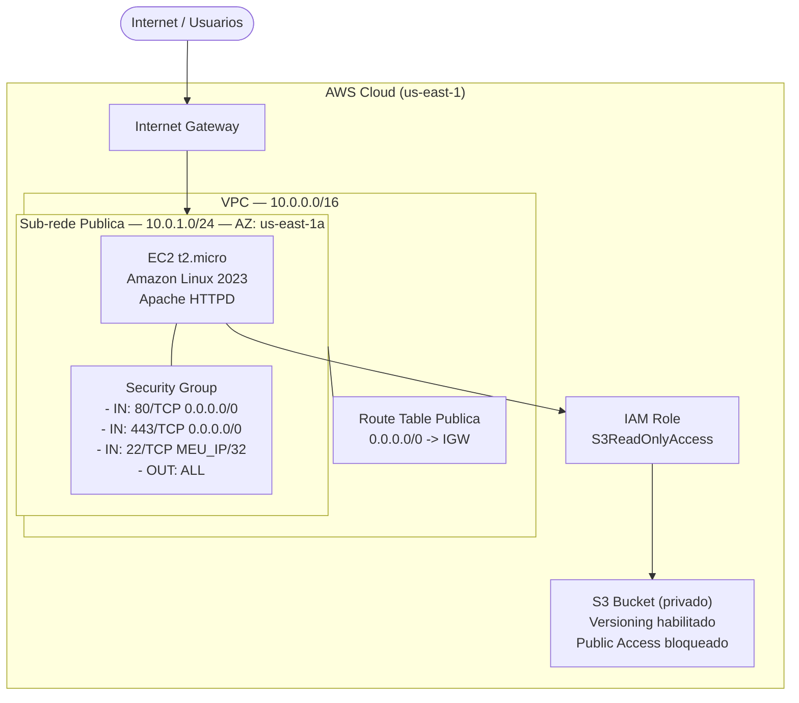

# Arquitetura do Projeto

## Visao Geral

Este projeto implementa uma aplicacao web na AWS com foco em seguranca de rede, controle de acesso e boas praticas de infraestrutura. A arquitetura foi projetada para ser simples, auditavel e reproduzivel via Terraform.

---

## Diagrama Detalhado



---

## Componentes

### VPC (Virtual Private Cloud)

- **CIDR**: 10.0.0.0/16
- **DNS Hostnames**: habilitado
- **DNS Support**: habilitado
- **Objetivo**: isolar os recursos do projeto em rede privada dedicada

### Sub-rede Publica

- **CIDR**: 10.0.1.0/24
- **Availability Zone**: us-east-1a
- **map_public_ip_on_launch**: true
- **Objetivo**: hospedar a instancia EC2 com acesso publico controlado

### Internet Gateway

- **Vinculado a**: VPC principal
- **Objetivo**: permitir comunicacao entre a VPC e a internet

### Route Table Publica

| Destino | Target |
|---|---|
| 0.0.0.0/0 | Internet Gateway |
| 10.0.0.0/16 | local |

### Security Group

| Tipo | Porta | Protocolo | Origem | Motivo |
|---|---|---|---|---|
| Ingress | 80 | TCP | 0.0.0.0/0 | HTTP publico |
| Ingress | 443 | TCP | 0.0.0.0/0 | HTTPS publico |
| Ingress | 22 | TCP | SEU_IP/32 | SSH restrito |
| Egress | All | All | 0.0.0.0/0 | Saida liberada |

### EC2

- **AMI**: Amazon Linux 2023 (mais recente)
- **Tipo**: t2.micro (elegivel ao Free Tier)
- **User Data**: instala e inicia Apache HTTPD automaticamente
- **IAM Instance Profile**: vinculado a IAM Role com S3ReadOnlyAccess

### IAM Role

- **Trust Policy**: apenas ec2.amazonaws.com pode assumir
- **Politica gerenciada**: AmazonS3ReadOnlyAccess
- **Principio**: menor privilegio — sem permissoes desnecessarias

### S3 Bucket

- **Acesso publico**: completamente bloqueado
- **Versioning**: habilitado
- **Uso**: armazenamento de artefatos, logs e arquivos da aplicacao
- **Nome**: gerado dinamicamente com sufixo unico para evitar conflitos globais

---

## Fluxo de Requisicao

```
Usuario (browser)
    |
    v
Internet
    |
    v
Internet Gateway (AWS)
    |
    v
Route Table Publica
    |
    v
Security Group (verifica porta e IP)
    |
    v
EC2 t2.micro (Apache HTTPD responde)
    |
    v  (quando necessario)
IAM Role -> S3 Bucket (leitura de artefatos)
```

---

## Consideracoes de Seguranca

1. **SSH restrito**: porta 22 deve ser liberada APENAS para o seu IP publico (`SEU_IP/32`)
2. **IAM com menor privilegio**: a EC2 acessa apenas o S3 (readonly), nenhum outro servico
3. **S3 privado**: nenhum acesso publico direto ao bucket
4. **Sem credenciais hardcoded**: autenticacao via IAM Role, nao via chaves no codigo
5. **Tags em todos os recursos**: facilita auditoria, billing e governanca
